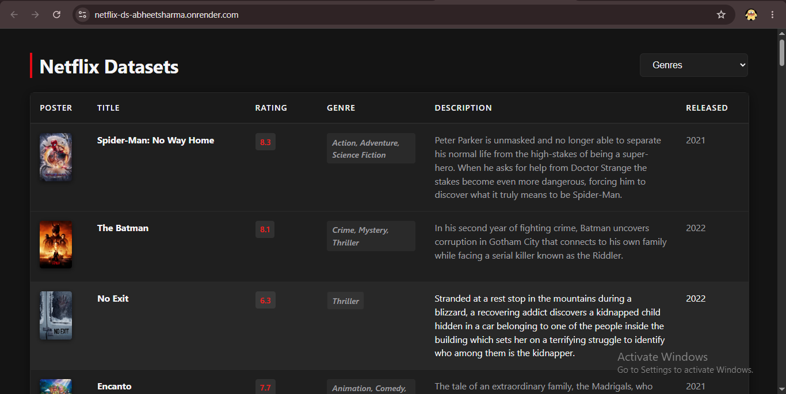

# Netflix Datasets Project

A foundational data-driven web application built while learning the Python Pandas library. This project bridges a local structured dataset with an interactive, responsive front-end user interface.

The application reads a dataset of Netflix movies and TV shows(downloaded from Kaggle) stored in a `.csv` file, processes pagination requests asynchronously, and allows users to dynamically filter content by genre without reloading the webpage.

## Live Demo
\
The application is deployed and accessible at: **[https://netflix-ds-abheetsharma.onrender.com/]**
*(Note: Due to free-tier hosting limits, the initial page request may experience a 30–50 second delay if the instance is spinning up from an inactive state).*

---

## Architecture Overview

The system operates on a classical Client-Server architecture handling structured local file storage:

1. **Frontend (Client):** Standard HTML5 and CSS3 paired with asynchronous native JavaScript (`Fetch API`) to manage content states, user dropdown choices, and scroll-pagination updates.
2. **Backend (Server):** A Python Flask application acting as the logic router and operational gateway.
3. **Data Layer:** A local CSV dataset loaded, cleaned, and sliced on-demand utilizing the Pandas library.

---

## Core Features Implemented

* **Asynchronous Pagination:** Content is batched out 50 records at a time. The system listens for manual UI events to load subsequent blocks via targeted row offsets.
* **Dynamic Content Filtering:** Real-time genre extraction maps the full scope of available genres directly from the dataset. Filtering recalculates pagination splits transparently on the fly.
* **Corrupted Record Bypass:** Integrated robust file parsing using the Python parsing engine configuration (`on_bad_lines='skip'`) to prevent buffer overflows or server-side application panics caused by unescaped characters in description text fields.
* **Mobile-Responsive Adaptability:** CSS media rules automatically collapse the dense multi-column layout table into structured informational modular cards, modifying image-scaling logic for smaller viewport configurations.

---

## Core Learning Outcomes (Pandas & Systems)

Developing this project provided concrete experience in several software engineering concepts:
* **Memory Optimization:** Loading distinct vector slices using `.iloc[start:end]` rather than loading entire custom filter sets repeatedly into live system memory blocks.
* **Data Sanitization & Preparation:** Handling structural null/NaN attributes using `.fillna()`.
* **Deployment Realities:** Configuring system environmental constraints via production-grade HTTP servers (`Gunicorn`), dependencies maps (`requirements.txt`), and infrastructural runtime mappings (`Procfile`).

---

## File Structure

```text
├── images/
├── data/
│   └── NETFLIXDb.csv         # Raw Netflix dataset
├── templates/
│   └── index.html            # UI Layout, responsive styles, and Fetch 
├── NETFLIX.py                # Main Flask entry point and data processing 
├── requirements.txt          # Python package dependency mapping
└── Procfile                  # Cloud platform process engine instructions