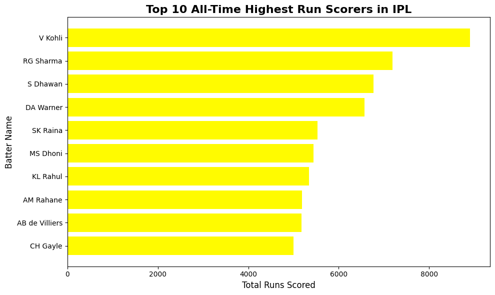
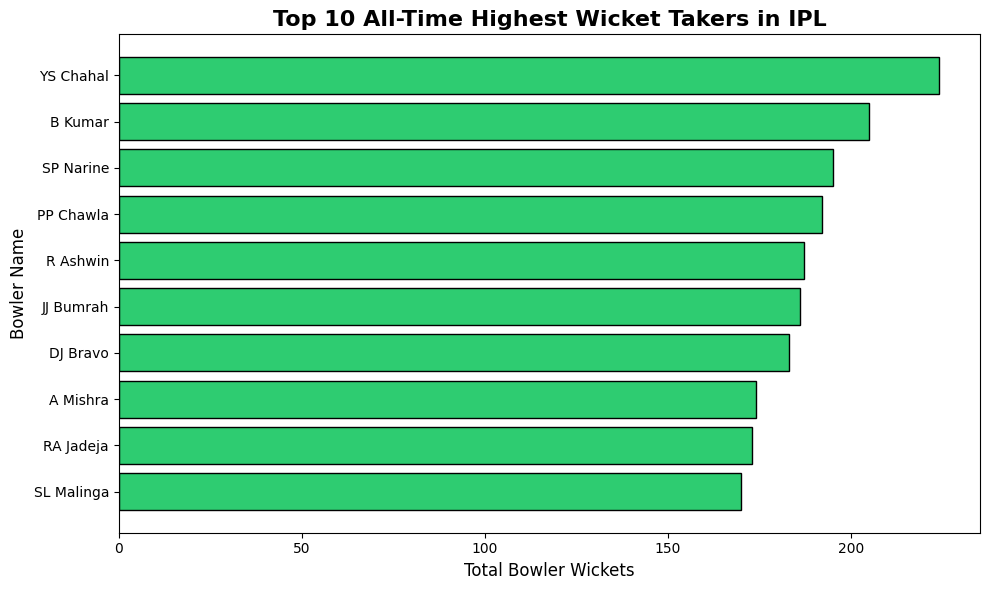
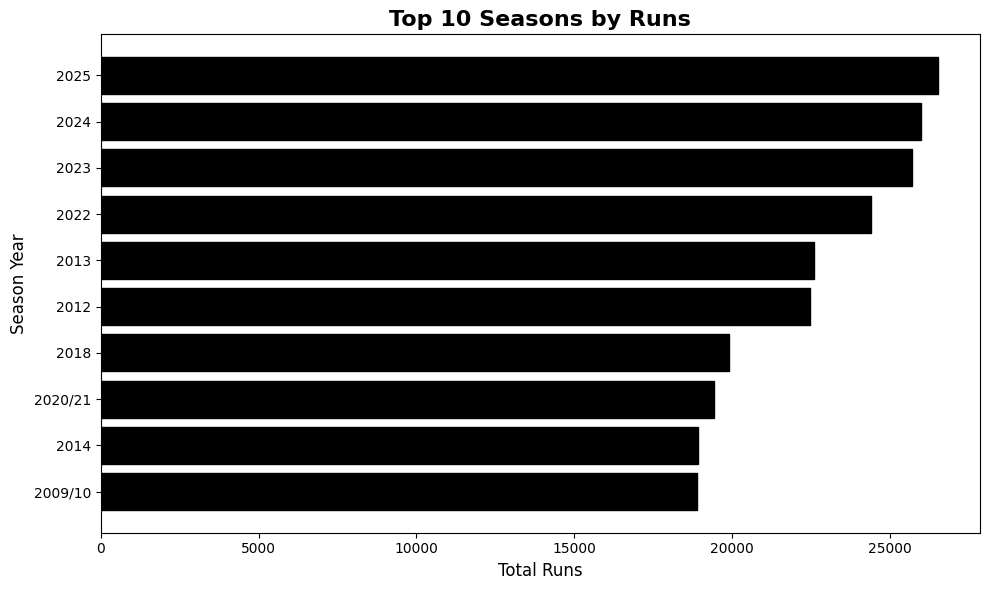
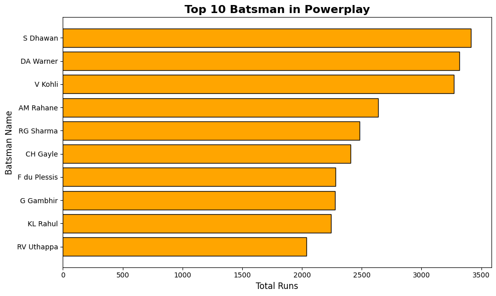
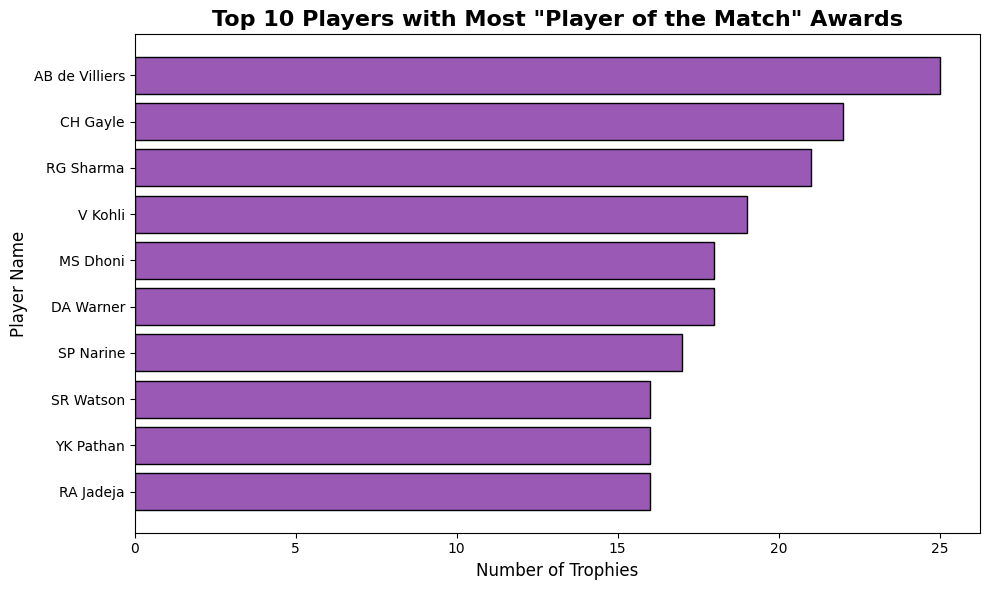

# Pandas Cricket Analysis Project

This project is a part of my learning journey in python pandas and matplotlib. My whole focus through out the implementation and learning is to get to the level where i feel comfortable with huge datasets that further help me in learning Advance concepts including Machine Learning, Deep Learning and so on.

## Projects and Implementations

So Here i take a IPL dataset in `.csv` formate from KAGGLE its 110MB big and contains bowl by bowl data of ipl from 2008 to 2026.I tried to answer 5 of the following questions from that huge `.csv` file

### TOP 10 BATTERS BY TOTAL RUNS IN ALL SEASON
\
Through this graph i try to gives the most obvious question arises in everyones mind that is "Who is the beast batsman??". Therefore, i used two important coloums `batter` and `runs_batter` and used the function `groupby()`.

### TOP 10 BALLERS BY THE TOTAL WICKET THROUGH OUT ALL SEASONS
\
This graph is also pretty similar to the first one it gives answer to "Who is the best bowler ever??". Therefore, i used 4 important coloums `'run out', 'retired hurt', 'obstructing the field' , 'wicket_kind` and used the function `groupby()`.Used `wicket_kind` to avoid runout dismisals.

### TOP 10 SEASON WITH MOST OF THE RUNS
\
Now, this graph plot info about which season has most of the runs.Pretty simple logic just sliced the data b/w `season` coloumn and `runs_total`.

### TOP BATSMAN WITH MOST OF THE RUNS IN POWERPLAY
\
First filter the over greater than 6..then groop the data with `batter` and `runs_batter` columns.

### MOST OF THE TIME MAN OF THE MATCH

Similar to the above graphs here also i pllotted a graph based on `man_of_the_match` and `batter` column

## Requirements and Instructions
First make sure you install pakages like `pandas` & `matplotlib`. Then download the [KAGGLE IPL DATASET](https://www.kaggle.com/datasets/yusufmurtaza01/ipl-dataset-year-wise)